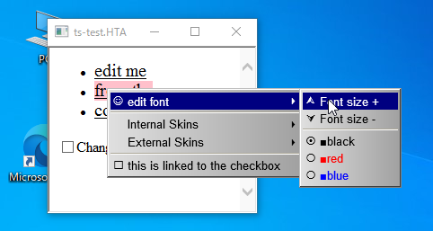
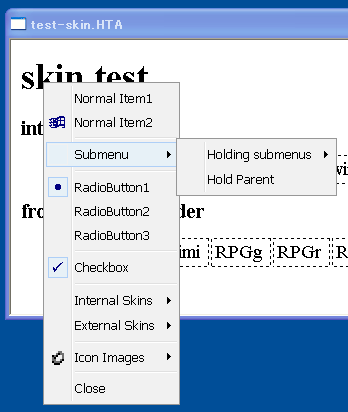
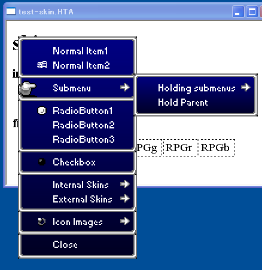
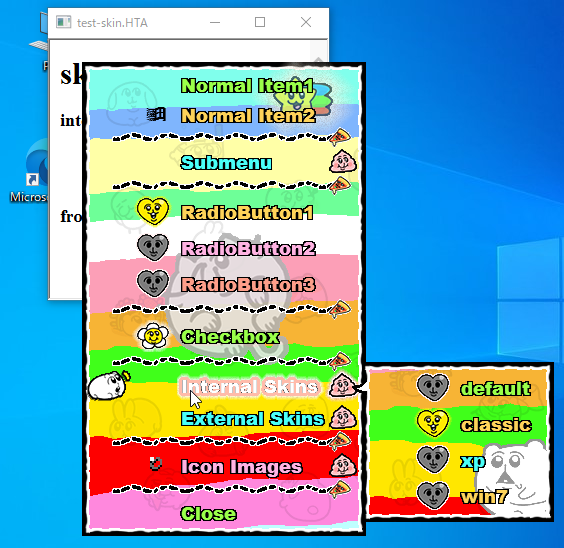

# hta-ctx-menu
Create "real" customizable context menus in *HTML Application* (**HTA**) for Windows OS.

Unlike the ordinary webpage-based context menus, this can be displayed **outside** of the document's window.



## Mechanism
* hta-ctx-menu uses `showModelessDialog` to create a menu, so the base object is not a `HTMLElement` but a `window`, which is not bound to the parent's `document.body`.
* The menus consist only of basic HTML/CSS+JavaScript, not using any kind of external components such as `ActiveXObject`, `<Object>`, `<Applet>` etc.


### Supported OS and versions of IE
* Windows XP or later
* Internet Explorer 6.0 or later

## Skins
It can be changed its appearance by applying a CSS. Several simple internal skins are also available.

[Skin Samples](./skins/)





## Installation

Save [`hta-ctx-menu.js`](./release/hta-ctx-menu.js?raw=true) to your local disk and load it from your **HTA** file.

```
<script src="hta-ctx-menu.js"></script>
```

### npm
```
npm install hta-ctx-menu
```
#### import:
```
import { HTAContextMenu } from "hta-ctx-menu";
```

#### Using Typescript:
```
please refer to the ./test folder in this repository
```


## Usage
```

// create an instance
var menu = new HTAContextMenu({
  items: [
    // type 'normal' is default item type.
    {
      type: 'normal',
      label: 'Select something',
      icon: {
        text: 'ÿ',
        fontFamily: 'WingDings'
      },
      onactivate: function(ev) {
        // do something
      }
    },
    // item type can be omitted when it is a 'noraml'
    {
      label: 'phone icon',
      onactivate: function(ev) {
        alert('ring!');
      },
      flash: 500,
      icon: {
        text:'(',
        fontFamily: 'WingDings'
      }
    },
    
    // type "checkbox" and "radio" items work similarly to <input> tags
    {
      type: 'checkbox',
      label: 'Check me',
      value: 'checked value',
      onchange: function(ev) {
        alert('checked: ' + ev.checked);
      }
    },
    {
      type: 'radio',
      name: 'radio-test',
      label: 'meaningless radio1'
    },
    {
      type: 'radio',
      name: 'radio-test',
      label: 'meaningless radio2(hold)',
      hold: true // the menu doesn't disappear by itself if "hold" flag is true
    },
    
    // it is a separator
    { type: 'separator' },
    
    // type "submenu" must have an "items" array that contains child items
    {
      type: 'submenu',
      label: 'Change Skin',
      items: [{
        type: 'radios',
        name: 'skins',
        labels: ['default', 'classic', 'xp', 'win7'],
        onchange: function(ev) {
          var value = ev.value;
          menu.loadSkin(value); // change skin
        }
      }]
    },
    { type: 'separator' },
    
    // type 'demand' item creates menu items dynamically just before opening the menu.
    // it must have an "ondemand" event handler that returns item parameter.
    {
      type: 'demand',
      label: 'demandable',
      ondemand: function(ev) {
        var target = ev.ctx; // context when the menu opened
        if( target ) {
          return [
            {
              type: 'normal',
              label: 'context element is <' + target.nodeName + '>'
            }
          ];
        }
      }
    }
  ]
});

// hook on oncontextmenu event handler
document.body.oncontextmenu = function() {
  // open the context menu at the specified position.
  // you can also specify its context in the third argument.
  menu.open(event.screenX, event.screenY, event.srcElement);
  
  return false;
};

```

## API Document

Under construction...
